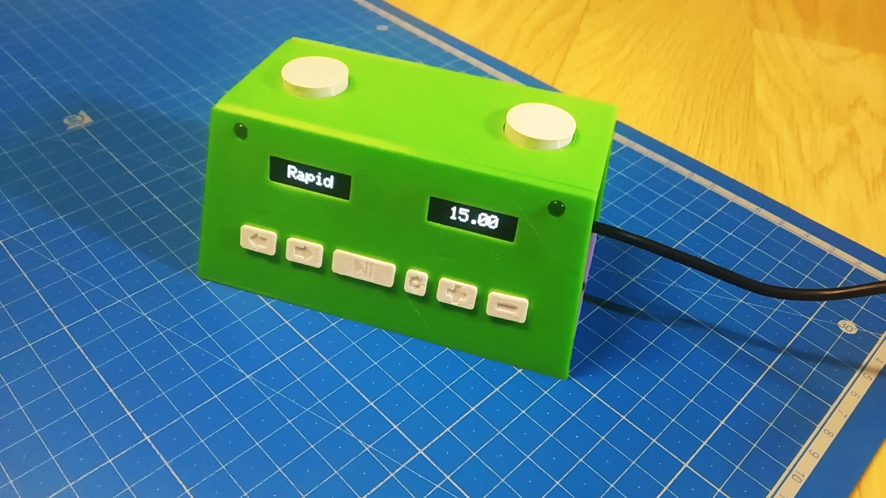
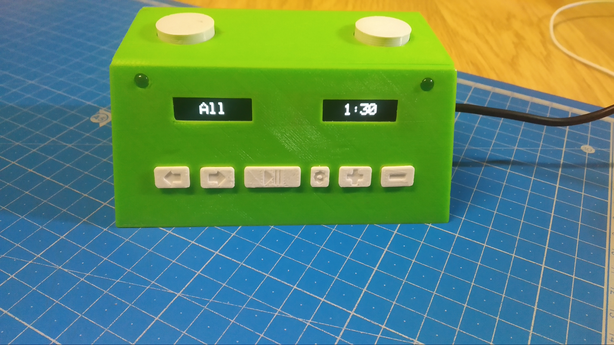
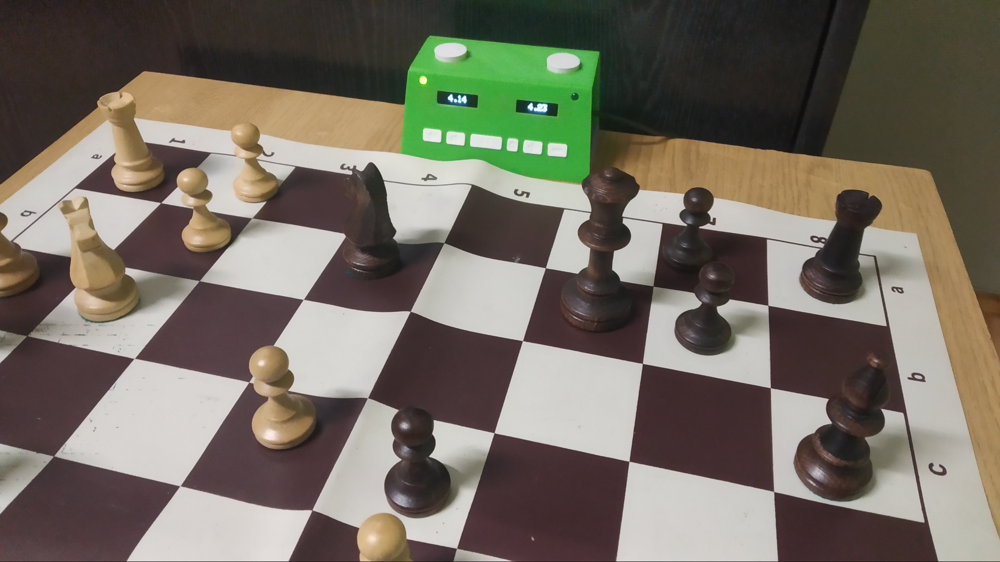
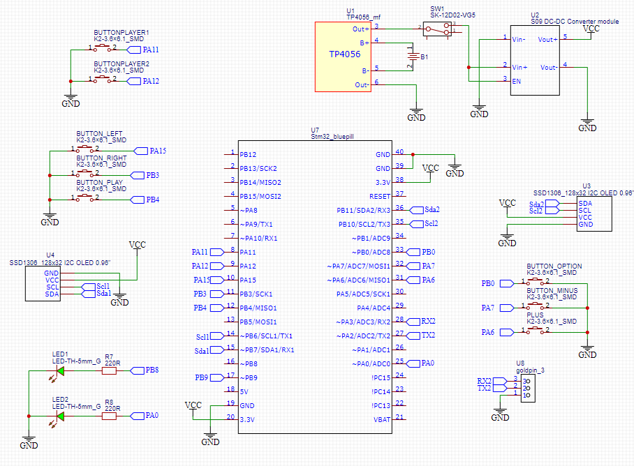
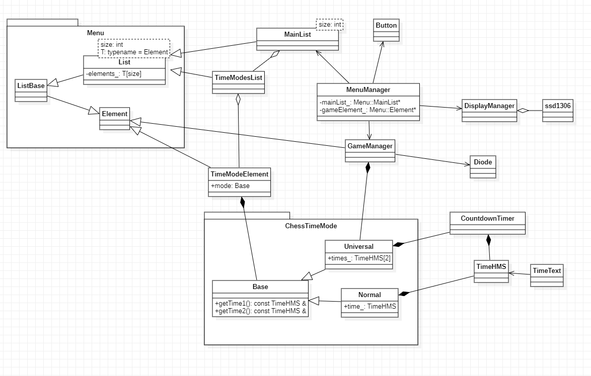

# ChessClock
This is a chess clock design for a microcontroller STM32.

## Table of Contents
* [Images](#images)
* [Technologies And Devices Used](#technologies-and-devices-used)
* [Electrical Diagram](#electrical-diagram)
* [Uml Diagram](#uml-diagram)
* [Project Status](#project-status)

## Images

## Technologies And Devices Used
- C++
- STM32CubeIDE
- Stm32 HAL
- STM32F103C8T6
- OLED display 128x32, SSD1306

## Electrical Diagram

## Uml Diagram

## Project Status
Project is: in progress
